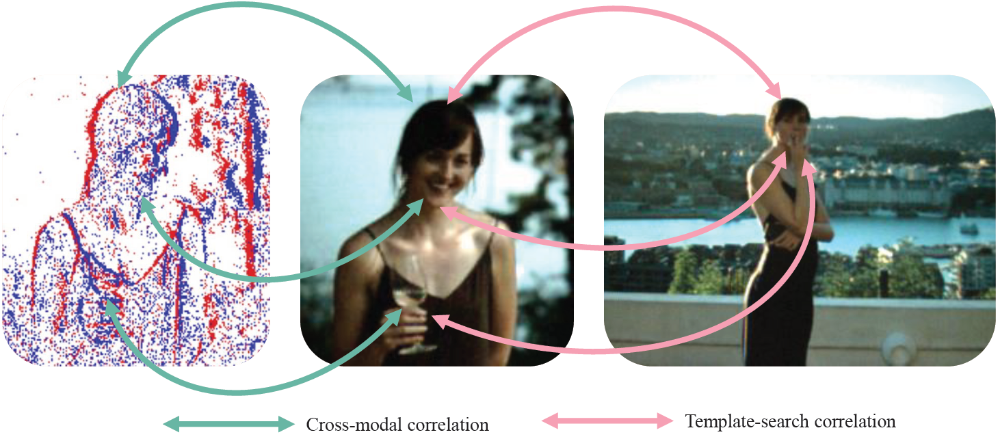
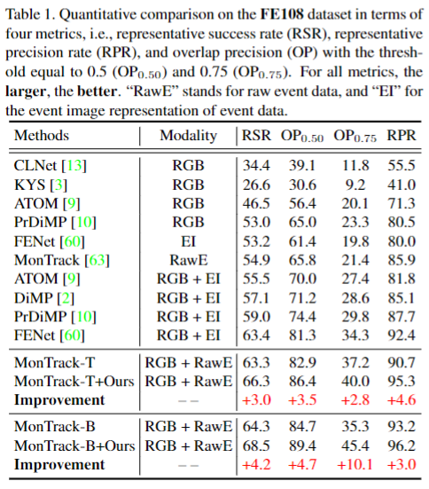
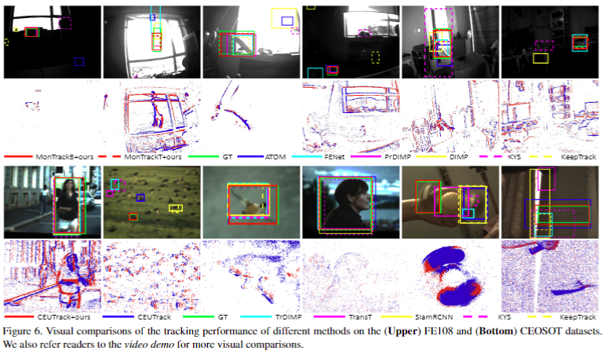

<!-- Improved compatibility of back to top link: See: https://github.com/ZHU-Zhiyu/High-Rank_RGB-Event_Tracker/pull/73 -->
<a name="readme-top"></a>

[![Issues][issues-shield]][issues-url]
[![MIT License][license-shield]][license-url]
<!-- [![MyHomePage][linkedin-shield]][linkedin-url] -->


<!-- PROJECT LOGO -->
<br />
<div align="center">
  <a href="https://github.com/ZHU-Zhiyu/High-Rank_RGB-Event_Tracker">
    
  </a>

  <h3 align="center">Cross-modal Orthogonal High-rank Augmentation for RGB-Event Transformer-trackers</h3>
  <h3 align="center">[ICCV 2023]</h3>
  <p align="center">
    <a href="https://arxiv.org/abs/2307.04129">Paper</a>
    ·
    <a href="https://github.com/ZHU-Zhiyu/High-Rank_RGB-Event_Tracker/issues">Report Bug</a>
    ·
    <a href="https://github.com/ZHU-Zhiyu/High-Rank_RGB-Event_Tracker/issues">Request Feature</a>
  </p>
</div>

<br />
<div align="center">
  <!-- <a href="https://github.com/ZHU-Zhiyu/High-Rank_RGB-Event_Tracker"> -->
    
    
    
  <!-- </a> -->
  <h6 align="center">Demos </h6>
</div>

<details>
  <summary>Table of Contents</summary>
  <ol>
    <li>
      <a href="#getting-started">Getting Started</a>
      <ul>
        <li><a href="#prerequisites">Prerequisites</a></li>
        <li><a href="#installation">Installation</a></li>
      </ul>
    </li>
    <!-- <li><a href="#usage">Usage</a></li> -->
    <!-- <li><a href="#roadmap">Roadmap</a></li> -->
    <!-- <li><a href="#contributing">Contributing</a></li> -->
    <li><a href="#license">License</a></li>
    <li><a href="#contact">Contact</a></li>
    <li><a href="#acknowledgments">Acknowledgments</a></li>
  </ol>
</details>


<!-- ABOUT THE PROJECT
## About The Project

[![Product Name Screen Shot][product-screenshot]](https://example.com)

There are many great README templates available on GitHub; however, I didn't find one that really suited my needs so I created this enhanced one. I want to create a README template so amazing that it'll be the last one you ever need -- I think this is it.

Here's why:
* Your time should be focused on creating something amazing. A project that solves a problem and helps others
* You shouldn't be doing the same tasks over and over like creating a README from scratch
* You should implement DRY principles to the rest of your life :smile:

Of course, no one template will serve all projects since your needs may be different. So I'll be adding more in the near future. You may also suggest changes by forking this repo and creating a pull request or opening an issue. Thanks to all the people have contributed to expanding this template!

Use the `BLANK_README.md` to get started.

<p align="right">(<a href="#readme-top">back to top</a>)</p>


### Built With

This section should list any major frameworks/libraries used to bootstrap your project. Leave any add-ons/plugins for the acknowledgements section. Here are a few examples.

* [![Next][Next.js]][Next-url]
* [![React][React.js]][React-url]
* [![Vue][Vue.js]][Vue-url]
* [![Angular][Angular.io]][Angular-url]
* [![Svelte][Svelte.dev]][Svelte-url]
* [![Laravel][Laravel.com]][Laravel-url]
* [![Bootstrap][Bootstrap.com]][Bootstrap-url]
* [![JQuery][JQuery.com]][JQuery-url]

<p align="right">(<a href="#readme-top">back to top</a>)</p>
 -->


<!-- GETTING STARTED -->
## Getting Started

<!-- This is an example of how you may give instructions on setting up your project locally.
To get a local copy up and running follow these simple example steps. -->

### Prerequisites
  1. clone the project
      ```sh
      git clone https://github.com/ZHU-Zhiyu/High-Rank_RGB-Event_Tracker.git
      ```
2. FE108
&nbsp;&nbsp; * Download data from [FE108](https://zhangjiqing.com/dataset/) 
&nbsp;&nbsp; * Transfer and clip data into h5py format
    ```sh
    python ./FE108/Evt_convert.py
    ```
    The directory should have the below format:
    <details open> <summary>Format of FE108 (click to expand)</summary>

    ```Shell
    ├── FE108 dataset (108 sequences)
        ├── airplane 
            ├── inter3_stack
                ├── 0001_1.jpg
                ├── 0001_2.jpg
                ├── 0001_3.jpg
                ├── 0002_1.jpg
                ├── ...
            ├── img
                ├── 0001.jpg
                ├── 0002.jpg
                ├── ...
            ├── events.aedat4
            ├── groundtruth_rect.txt
        ├── airplane_motion
            ├── ... 
        ├── ... 
        ├── Event file(108 sequences)
            ├── airplane.h5
            ├── airplane_motion.h5
            ├── ... 

    ```
    </details>
3. COESOT
&nbsp;&nbsp; * Download data from [COESOT](https://github.com/Event-AHU/COESOT)
&nbsp;&nbsp; * Transfer and clip data into mat files
    ```sh
    python ./COESOT/data.py
    ```
    The directory should have the below format:
    <details open> <summary>Format of COESOT (click to expand)</summary>

    ```Shell
    ├── COESOT dataset
        ├── Training Subset (827 sequences)
            ├── dvSave-2021_09_01_06_59_10
                ├── dvSave-2021_09_01_06_59_10.aedat4
                ├── groundtruth.txt
                ├── absent.txt
                ├── start_end_index.txt
            ├── ... 
        ├── trainning voxel (827 sequences)
            ├── dvSave-2022_03_21_09_05_49
              ├── dvSave-2022_03_21_09_05_49_voxel
                ├── frame0000.mat
                ├── frame0001.mat
                ├── ... 
            ├── ... 
        ├── Testing Subset (528 sequences)
            ├── dvSave-2021_07_30_11_04_12
                ├── dvSave-2021_07_30_11_04_12_aps
                ├── dvSave-2021_07_30_11_04_12_dvs
                ├── dvSave-2021_07_30_11_04_12.aedat4
                ├── groundtruth.txt
                ├── absent.txt
                ├── start_end_index.txt
            ├── ... 
        ├── testing voxel (528 sequences)
            ├── dvSave-2022_03_21_11_12_27
              ├── dvSave-2022_03_21_11_12_27_voxel
                ├── frame0000.mat
                ├── frame0001.mat
                ├── ... 
            ├── ... 
    ```
    </details>
### Installation
1. One stream tracker: MonTrack
   ```sh
   conda create -n montrack python==3.8
   conda activate montrack
   cd ./MonTrack
   conda install --yes --file requirements.txt
   ```
    Then install [KNN_CUDA](https://github.com/unlimblue/KNN_CUDA)

2. Two-streams tracker: CEUTrack
   ```sh
   conda create -n CEUTrack python==3.8
   conda activate CEUTrack
   cd ./CEUTrack
   sh install.sh
   ```


### Training
1. One stream tracker: MonTrack
   ```sh
   conda create -n montrack python==3.8
   conda activate montrack
   cd ./MonTrack
   conda install --yes --file requirements.txt
   ```
    Then install [KNN_CUDA](https://github.com/unlimblue/KNN_CUDA)

2. Two-streams tracker: CEUTrack
   ```sh
   conda create -n CEUTrack python==3.8
   conda activate CEUTrack
   cd ./CEUTrack
   sh install.sh
   ```

### Evaluation
<br />
<div align="center">
  <a href="https://github.com/ZHU-Zhiyu/High-Rank_RGB-Event_Tracker">
    
    ...........
    
  </a>
  <!-- <h6 align="center">Demos </h6> -->
</div>
<br />
<div align="center">
  <a href="https://github.com/ZHU-Zhiyu/High-Rank_RGB-Event_Tracker">
    
  </a>
  <!-- <h6 align="center">Demos </h6> -->
</div>

1. One stream tracker: MonTrack
   ```sh
   conda create -n montrack python==3.8
   conda activate montrack
   cd ./MonTrack
   conda install --yes --file requirements.txt
   ```
    Then install [KNN_CUDA](https://github.com/unlimblue/KNN_CUDA)

2. Two-streams tracker: CEUTrack
   ```sh
   conda create -n CEUTrack python==3.8
   conda activate CEUTrack
   cd ./CEUTrack
   sh install.sh
   ```

<!-- <p align="right">(<a href="#readme-top">back to top</a>)</p>

## Usage

Use this space to show useful examples of how a project can be used. Additional screenshots, code examples and demos work well in this space. You may also link to more resources.

_For more examples, please refer to the [Documentation](https://example.com)_

<p align="right">(<a href="#readme-top">back to top</a>)</p> -->


<!-- ROADMAP -->
## Roadmap

- [x] Update ReadMe
- [x] Upload Code
- [ ] ....

<p align="right">(<a href="#readme-top">back to top</a>)</p>


<!-- CONTRIBUTING
## Contributing

Contributions are what make the open source community such an amazing place to learn, inspire, and create. Any contributions you make are **greatly appreciated**.

If you have a suggestion that would make this better, please fork the repo and create a pull request. You can also simply open an issue with the tag "enhancement".
Don't forget to give the project a star! Thanks again!

1. Fork the Project
2. Create your Feature Branch (`git checkout -b feature/AmazingFeature`)
3. Commit your Changes (`git commit -m 'Add some AmazingFeature'`)
4. Push to the Branch (`git push origin feature/AmazingFeature`)
5. Open a Pull Request

<p align="right">(<a href="#readme-top">back to top</a>)</p> -->


<!-- LICENSE -->
## License

Distributed under the MIT License. See `LICENSE.txt` for more information.

<p align="right">(<a href="#readme-top">back to top</a>)</p>


<!-- CONTACT -->
## Contact

Email - [Zhu Zhiyu](zbzhzhy@gmail.com)

Homepage: [Page](https://zhu-zhiyu.netlify.app/) / [Scholar](https://scholar.google.com/citations?user=d1L0KkoAAAAJ&hl)

<p align="right">(<a href="#readme-top">back to top</a>)</p>


<!-- ACKNOWLEDGMENTS -->
## Acknowledgments
Thanks to [FE108](https://zhangjiqing.com/dataset/)  and [COESOT](https://github.com/Event-AHU/COESOT) datasets.

If you find the project is interesting, please cite
   ```sh
   @article{zhu2023cross,
  title={Cross-modal Orthogonal High-rank Augmentation for RGB-Event Transformer-trackers},
  author={Zhu, Zhiyu and Hou, Junhui and Wu, Dapeng Oliver},
  journal={International Conference on Computer Vision},
  year={2023}
}
@article{zhu2022learning,
  title={Learning Graph-embedded Key-event Back-tracing for Object Tracking in Event Clouds},
  author={Zhu, Zhiyu and Hou, Junhui and Lyu, Xianqiang},
  journal={Advances in Neural Information Processing Systems},
  volume={35},
  pages={7462--7476},
  year={2022}
}
   ```

Template from [othneildrew](https://github.com/othneildrew/Best-README-Template).

<p align="right">(<a href="#readme-top">back to top</a>)</p>


<!-- MARKDOWN LINKS & IMAGES -->
<!-- https://www.markdownguide.org/basic-syntax/#reference-style-links -->
[contributors-shield]: https://img.shields.io/github/contributors/ZHU-Zhiyu/High-Rank_RGB-Event_Tracker.svg?style=for-the-badge
[contributors-url]: https://github.com/ZHU-Zhiyu/High-Rank_RGB-Event_Tracker/graphs/contributors
[forks-shield]: https://img.shields.io/github/forks/ZHU-Zhiyu/High-Rank_RGB-Event_Tracker.svg?style=for-the-badge
[forks-url]: https://github.com/ZHU-Zhiyu/High-Rank_RGB-Event_Tracker/network/members
[stars-shield]: https://img.shields.io/github/stars/ZHU-Zhiyu/High-Rank_RGB-Event_Tracker.svg?style=for-the-badge
[stars-url]: https://github.com/ZHU-Zhiyu/High-Rank_RGB-Event_Tracker/stargazers
[issues-shield]: https://img.shields.io/github/issues/ZHU-Zhiyu/High-Rank_RGB-Event_Tracker.svg?style=for-the-badge
[issues-url]: https://github.com/ZHU-Zhiyu/High-Rank_RGB-Event_Tracker/issues
[license-shield]: https://img.shields.io/github/license/ZHU-Zhiyu/High-Rank_RGB-Event_Tracker.svg?style=for-the-badge
[license-url]: https://github.com/ZHU-Zhiyu/High-Rank_RGB-Event_Tracker/blob/master/LICENSE.txt
[linkedin-shield]: https://img.shields.io/badge/-LinkedIn-black.svg?style=for-the-badge&logo=linkedin&colorB=555
[product-screenshot]: images/screenshot.png
[Next.js]: https://img.shields.io/badge/next.js-000000?style=for-the-badge&logo=nextdotjs&logoColor=white
[Next-url]: https://nextjs.org/
[React.js]: https://img.shields.io/badge/React-20232A?style=for-the-badge&logo=react&logoColor=61DAFB
[React-url]: https://reactjs.org/
[Vue.js]: https://img.shields.io/badge/Vue.js-35495E?style=for-the-badge&logo=vuedotjs&logoColor=4FC08D
[Vue-url]: https://vuejs.org/
[Angular.io]: https://img.shields.io/badge/Angular-DD0031?style=for-the-badge&logo=angular&logoColor=white
[Angular-url]: https://angular.io/
[Svelte.dev]: https://img.shields.io/badge/Svelte-4A4A55?style=for-the-badge&logo=svelte&logoColor=FF3E00
[Svelte-url]: https://svelte.dev/
[Laravel.com]: https://img.shields.io/badge/Laravel-FF2D20?style=for-the-badge&logo=laravel&logoColor=white
[Laravel-url]: https://laravel.com
[Bootstrap.com]: https://img.shields.io/badge/Bootstrap-563D7C?style=for-the-badge&logo=bootstrap&logoColor=white
[Bootstrap-url]: https://getbootstrap.com
[JQuery.com]: https://img.shields.io/badge/jQuery-0769AD?style=for-the-badge&logo=jquery&logoColor=white
[JQuery-url]: https://jquery.com 
